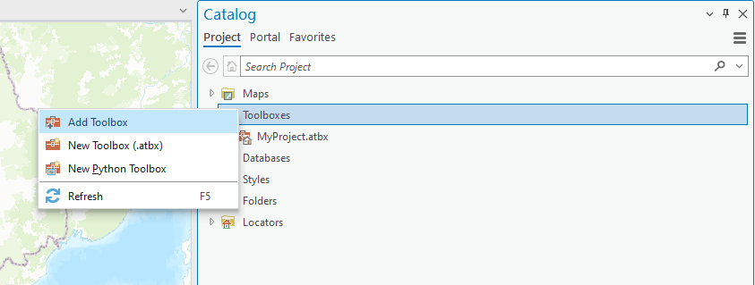
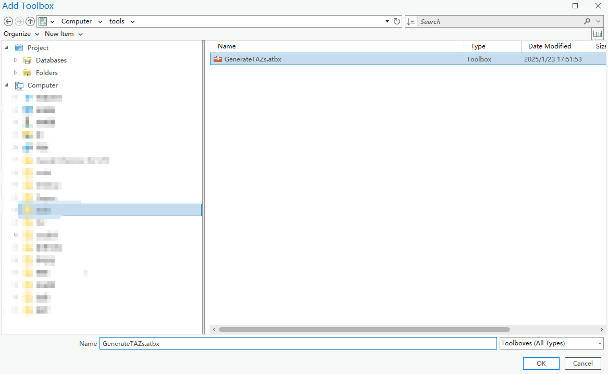
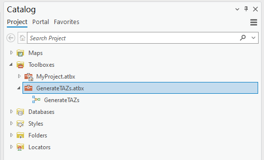
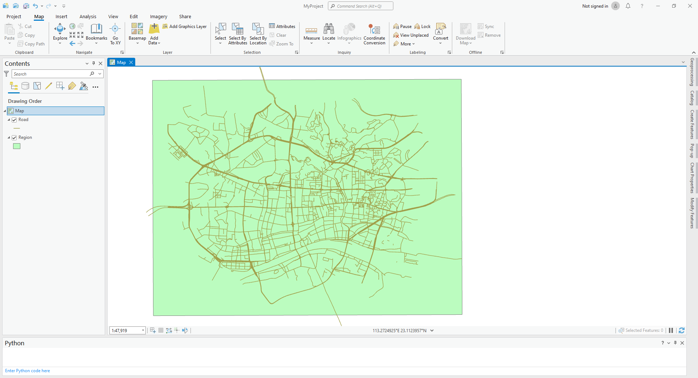
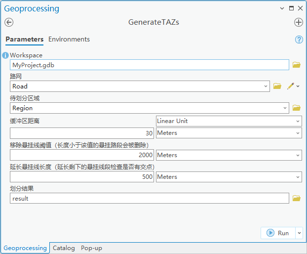
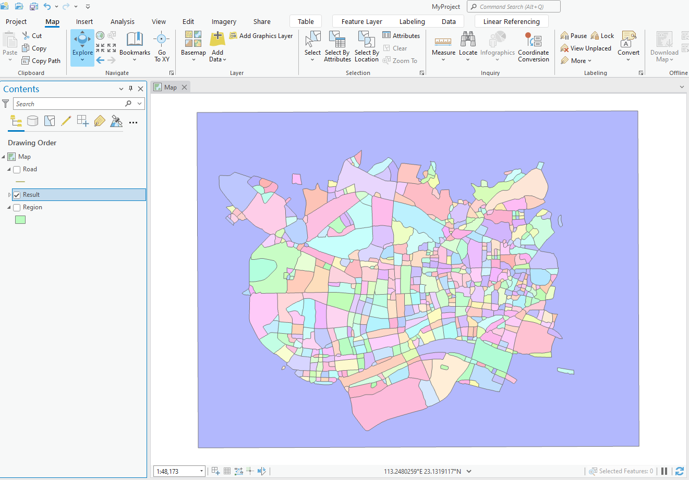

# 1 工具介绍
  该工具是基于ARCGIS PRO的model builder构建，可用于生成交通分析小区等。
# 2 运行环境
  Arcgis pro
# 3 目录结构描述
    ├── Tool/GenerateTAZs.atbx //工具源文件
    ├── ReadMe.md           // 帮助文档
# 4 使用说明
## 4.1 加载工具
在Arcgis Pro中加载工具

## 4.2 使用工具
数据准备，线数据以及待分割的面数据

打开工具，输入相应参数

运行工具，查看生成结果

